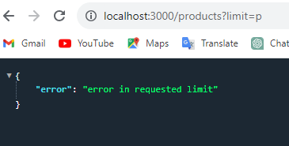
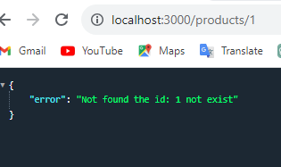
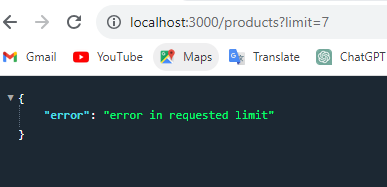
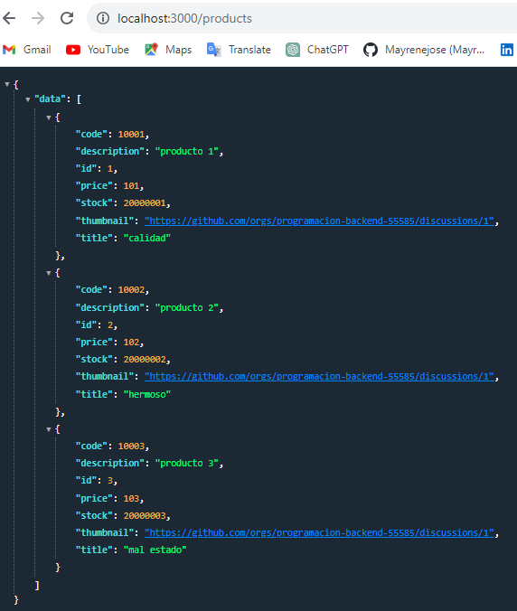
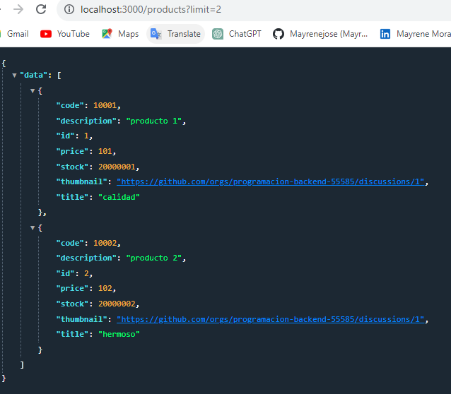
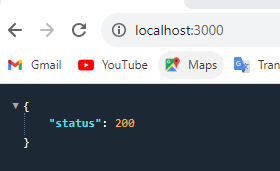
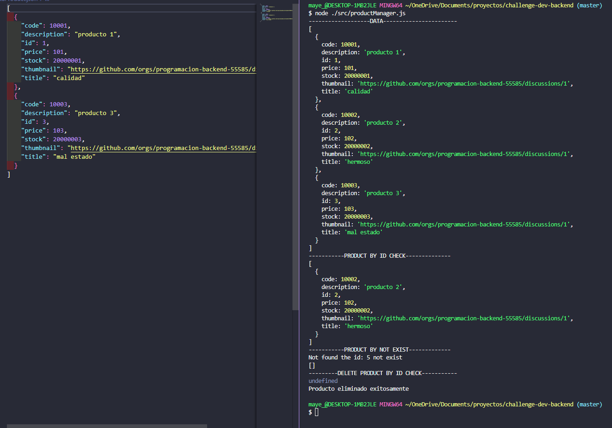
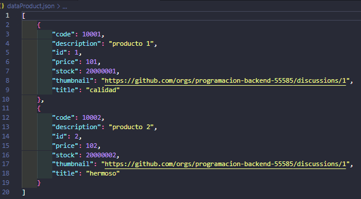

# Challenge-dev-backend - 3
- Creacion de enpoints 'GET'

### Manejo de errores:

### Respuestas métodos GET:

# Challenge-dev-backend - 2
- Agregando fileSystem para preservar nuestra data

# Challenge-dev-backend - 1

### getAllProducts:

### getProductById:

